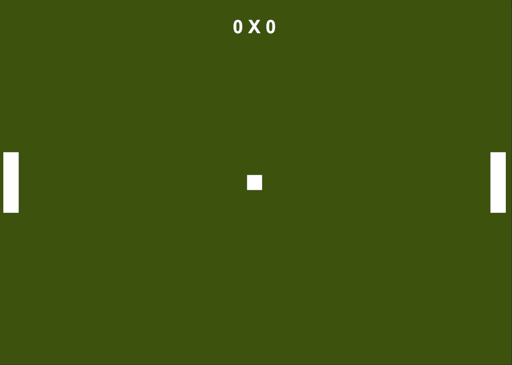

# Super-Pong

    

Projeto desenvolvido na **Unity** com o objetivo de praticar conceitos básicos de desenvolvimento de jogos, como movimentação de objetos, colisões, gerencimento de estados e interface gráfica.

O jogo é uma recriação do clásico **Pong**, no qual dois jogadores controlam traves para rebater a bola e marcam pontos quando ela ultrapassa as traves do adversário. Ele foi desenvolvido com base  na playlist [Curso Unity 6](https://www.youtube.com/playlist?list=PLARDsRa4d7UyZF3cf9tbp_6vN3M737DY2).

---
## Funcionalidades
- Movimentação dos dois paddles por teclado.
- Movimentação da bola.
- Colisão da bola com os paddles.
- Colisão da bola com os limites superior e inferior da tela.
- Sistema de pontuação.
- Placar em tempo real.
- Reinício da bola após cada ponto.
- Inversão da direção inicial da bola após cada ponto.
- Aumento progressivo da velocidade da bola conforme a pontuação.
- Limite máximo de pontos para encerrar a partida.
- Atraso de 2 segundos para reinício da bola após cada ponto.
- Início da partida mediante pressionamento da tecla **Espaço**.
- Troca dinâmica de cores durante a partida.

---
## Tecnologias utilizadas

- Unity 6 (6000.3.13f1)
- C#
- Visual Studio Code
- .NET (10.0.201)

## Como executar

1. Clone este repositório.

2. Abra o projeto pela Unity Hub (Não esqueça de verificar se está urilizando as mesmas tecnologias e verssões especificadas na seção anterior).

3. Execute a cena `Main`.

---
## Jogar

Acesse [Super Pong v1.0.0 ](https://github.com/Evelini-Bittencourt/Super-Pong/releases/tag/v1.0.0) e siga as intruções.

## Controles

| Jogador | Teclas |
|---------|--------|
| Esquerda | W / S |
| Direita | ↑ / ↓ |
| Iniciar partida | Espaço |

---

## Aprendizados

Durante o desenvolvimento deste projeto foram praticados conceitos como:

- Manipulação de Transform.
- Uso do ciclo de vida do MonoBehaviour.
- Captura de entrada do teclado.
- Colisões utilizando cálculos de posição.
- Manipulação de UI.
- Comunicação entre scripts.

---

## Autor

Desenvolvido por **Evelini Bittencourt Riemer**.